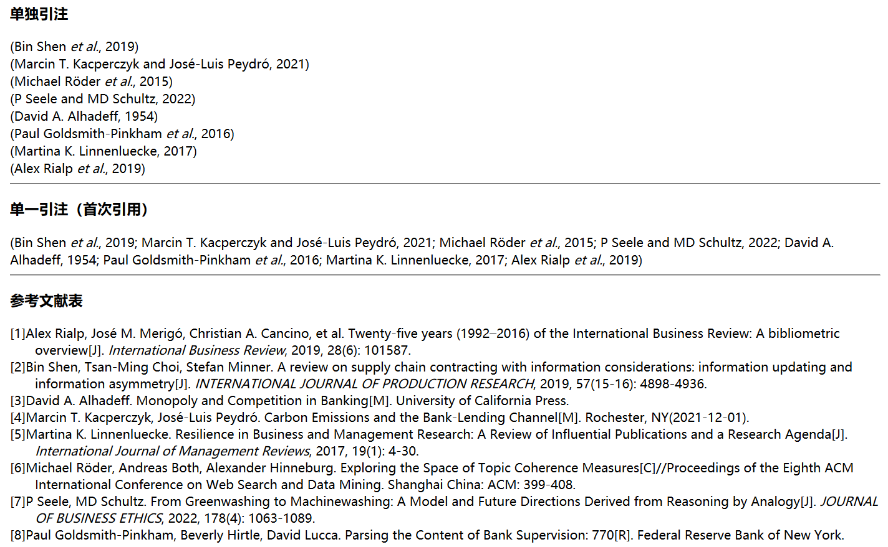

# Reference-Styles-for-Zotero
自用Zotero引文文件，基于GB/T2014-2015修改。Self use Zotero citation file，modified based on GB/T 2014-2015

在牛耕田等发布的Zotero引文格式修改，主要更改了以下几个内容:

1. 未按照国标 10.2.2 节要求，姓氏与“et al.”“等”之间留适当空隙

1. 删除了文献标识符的OL项。[J/OL]将会显示成[J]

1. 删除了引用日期

1. 注释掉了访问链接

1. 参考文献表取消了“等”的注释，这样英文论文将会使用“et al.”

1. 英文姓名改为单词首字母大写

1. 两个作者之间用“和”进行连接

1. 增加参考文献表期刊名斜体要求

1. 移动了出版年份，到期刊后面

## 预览：自用中文论文引文格式(author et al., year)

.png)

## 预览：自用中文论文引文格式([n-m])

![自用中文论文引文格式([n-m])](./.asset/自用中文论文引文格式([n-m]).png)

## 预览：自用英文论文引文格式

